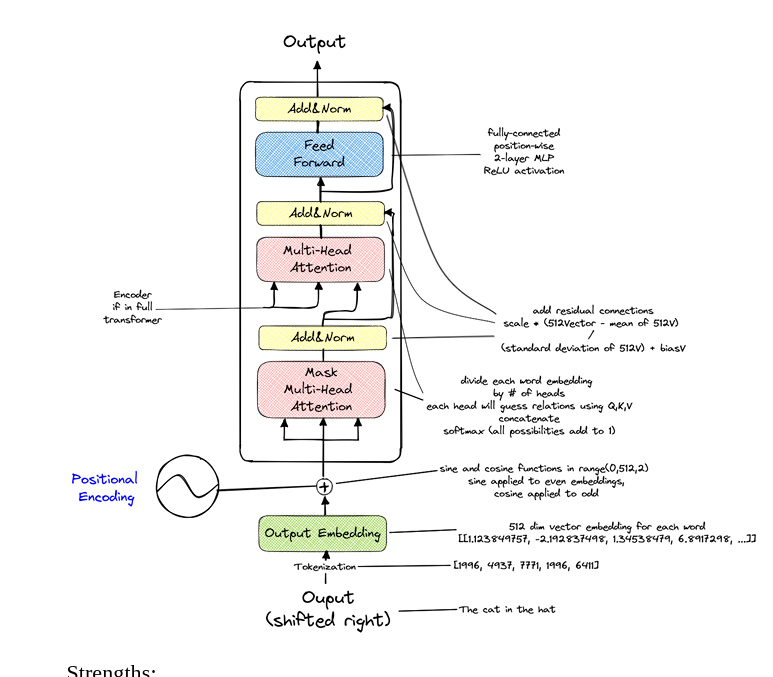

# LLMS 

1. [kimi-ai, a vision language model with only 2.8B active parameters, Mixture of Experts model](https://huggingface.co/moonshotai/Kimi-VL-A3B-Instruct)
#llm #rnd 

#### OSworld
:scalable, real computer environment designed for benchmarking and developing multimodal AI agents that can perform open-ended tasks across multiple operating systems, including Ubuntu, Windows, and macOS

# Mixture of Experts 
pecialized sub-networks (called "experts") and uses a gating mechanism to dynamically select which experts handle each input. 

core components are experts, gating network(distributes the tasks to the experts), combiner(Aggregates the outputs from the selected experts)

## KL  divergence

quantifies how one probability distribution Q differs form a true or reference probability distribution P over same variable, meaning (suppose you have a random variable X that can take values from a set X for example X={a, b,c}, both distributions P and Q assign probabilities to each possible vlaue x belogns to X, KL divergence compares how the probability assigned by P differ from those assigned by Q for each/same outcomes)

########################################################

# llms in production

1. Building gets you all the things buying struggles with: privacy, control, and
flexibility.
2. New technologies are like fire, they can provide warmth on cold nights and
help cook our food, but they can also burn our homes and hurt us.
3. BigScience is a large-scale, international, open-science research project focused on creating a multilingual, transparent, and open-source large language model (LLM) for natural language processing (NLP)
4. What we find when solving language related problems is that building a prototype is easy, building a functioning product on the other hand is very,very difficult.
5. A demo only has to work once, but the product has to work every time.
6. Semiotics is the systematic study of signs and symbols and how they create and communicate meaning.
7. Language, as a concept, is an abstraction of the feelings and thoughts that occur to us in our heads.
8. Mathematics is an abstraction of language focusing on logic and provability. 
9. Layers of abstraction hide complexity by offering simpler interfaces. In computing, they span from raw binary and machine code up through assembly, C, and high‑level languages like Python. Each level shields details of the one below, boosting efficiency. Human thought works similarly: sensory data become concepts, words, sentences, and then richer ideas—each step organizing information but risking loss or distortion of meaning.
10. pragmatics means Study of language use in context—how meaning depends on situational factors, speaker intent, and social context.
11. phonetics involved actual sound of the language. 
12. Language is made up of five fundamental components namely phonetics, syntax, pragmatics, morphology and semantics.
12. Phonetics is listed first here because it’s the place that LLMs have been applied to the least out of all the features and therefore have the largest space  for improvement.
13. Syntax is the part of language where existing LLMs  are highest performing both in parsing syntax from users and generating its own. 
14. For example, giving a storm a human name or describing a computer as "malicious" are forms of anthropomorphization.Anthropomorphization (also called anthropomorphism) is the attribution of human characteristics, traits, emotions, or intentions to non-human entities, such as animals, objects, natural phenomena, or abstract concepts.
15. Entailment refers to a logical relationship between statements where if one statement (A) is true, then another statement (B) must also be true. In other words, statement B is a necessary consequence of statement A. For examples: All birds have wings,a sparrow has wings. 
16. entailments are the hidden meanings or implied deatilas in your data beyond the exact words, good data engineering means including clear examples that cover these hidden details. By managing both explicit and implied information, you create stronger models and can better find and fix problems.
17. Model uses dictionary(vocabulary) to map tokens to unique numbers (conversion of text to numbers), if any words or symbols that is not present in vocabulary is encountered, the model replaces it with a special token. BytePairEncoding(BPE) and sentencepiece are some of modern tokenization algorithm. (how does the vocabulary is created behind the scene? initially toknizer vocabulary consists of all individual characters then with the help of algorithms the tokenizer recognizes most frequent pair of characters together and and merges them into single token where this process is repeated until the vocabulary reaches the preset size.)
18. he recursive Peircean semiotic triangle shows how a sign leads to an interpretation, which becomes a new sign leading to further interpretations, creating an endless cycle of meaning-making. This helps explain how communication, understanding, and meaning are dynamic and constantly developing rather than static.  
19.  People have wanted to understand or exploit each other since the first civilizations made contact.
20. Exacerbate means to make a problem, situation, or feeling worse or more severe.
21. Idiosyncrasies are unique or unusual habits, behaviors, or characteristics that are specific to a person, group, or thing.
22. BoW(Bags of words) represents text as a collection of words focusing solely on word frequency without considering grammer, word order or context. It splits words by whitespace and doesn't handles prefixes and suffixes.  
23. In N-Gram, it uses the previous N-1 words to predict the next word. For example, in a trigram model (N=3), it looks at the previous 2 words to predict the 3rd.This adds a bit of context to the model, helping it understand word order and common phrases.N-Gram models improve on BoW by considering sequences of words, giving the model some sense of context.
24. Bayesian models, like the Naïve Bayes classifier, assume feature independence to classify data efficiently, though they may lack the ability to model sequences or generate language naturally.
25. Bayes’ theorem is a mathematical formula that calculates the probability of a hypothesis being true given new evidence by updating prior knowledge with the likelihood of that evidence
26. Hidden markov models are stochastic(probabilistic) models that extends N-gram models by including hidden states (like part of speech tagging or Named entity recognition) which allow the capturing the dependencies based on these hidden states rather than just observable word sequences. HMM doesn't generates the  sequence of words rather help classifying or tagging the text serving as building blocks before modern transformer based llms. 
HMMs are incredible fast and often used in predictive text or predictive search applications.

    Imagine generating a sentence, and you want to predict the next word based not only on the previous word but also on the part-of-speech tag (hidden state) of the current word. For instance, if your current hidden state is "adjective," the model learns that the next word is likely a "noun." So, after the sequence "I am," if the model’s hidden state is "verb (am)," it will predict a high probability for "happy" (adjective) next, but after outputting "happy," it lowers the chance of "happy" appearing again immediately and instead expects words like "today" (noun).

27. *"Hearkening" means listening closely or paying careful attention to something*
28. *Quintessential means representing the most perfect or typical example of something.*

29. Vector embeddigns is a way to represent the texts (words,sentences) as a list of numbers so that the  model/computer understands and compare the meaning, words with similar meanign have similar  vector(number) representation.

30. Word2Vec: a method that learns vector embeddigns for words by analysing large text corpus so that words used in similar context have vector close to  each others,helping model understand word meanings better. 

31. A type of neural network designed to process sequences—like sentences—by remembering previous words in the sequence to better predict the next one, but it can struggle with very long sentences (why?:due to the vanishing gradient problem, where the influence of earlier words fades exponentially during training, making it hard to learn long-term dependencies and capture important context from distant words) Q. how will today's llms like chatgpt will be if the core of their architecture was rnn rahter than transformer?, A:forgetfulness in long multi-turn conversations, less coherent and detailed answers and lose track of formatting, sequence, or logic as the output grows, producing sections that don’t fit well together..

32. LSTM is a special kind of RNN that can remember important information for longer periods in sequences, improving the handling of longer texts by keeping or forgetting data smartly within the sequence.

33. Attention is a mathematical shortcut for solving larger context windows faster by telling the model through an emergent mathematical formula which parts of an input to consider and how much. where instead of just Key and Value pairs, a contextual Query is added. 

34. Seminal means something that is very important and influential, often because it introduces new ideas or lays the foundation for future developments.

35. transformers (encoder and decoder)

The Text-To-Text Transfer Transformer (T5) family of models are examples of transformers.

36. However, what really makes LLMs powerful and has opened the door to widespread business use cases is their ability to do specialized tasks without any finetuning, but just simple prompting. 

37. This is called few-shot prompting when it’s trained on smaller labeled data sizes, one-shot, when given only one example, and zero-shot, when the task is totally novel.

38. The five components of linguistics are phonetics, syntax, semantics, pragmatics, and morphology. 
Phonetics can be added through a multimodal model that processes audio files and is likely to improve LLMs in the future, but current datasets are too small. 
Syntax is what current models are good at. 
Semantics is added through the embedding layer. 
Pragmatics can be added through engineering efforts. 
Morphology is added in the tokenization layer.

39. 

